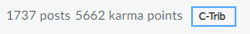

# Contribute to the Umbraco Documentation

The Umbraco Documentation is presented here on [Our Umbraco](https://our.umbraco.com/documentation), but is in fact also a [GitHub repository](https://github.com/umbraco/UmbracoDocs) and it is as open source as the [Umbraco CMS](https://github.com/umbraco/Umbraco-CMS).

You can contribute to the documentation whenever you feel something is missing or out of date, and all you need to do it, is an account on GitHub.

In this section you can learn more about the various ways of contributing.

## How to get started

There are many ways in which you can contribute to the Umbraco Documentation. Which approach to take, depends on what you want to achieve with your contribution.

* Request a quick / minor change to an article by submitting a [Pull Request](https://github.com/sofietoft/ContribTests/tree/b4925c6fc368b3ce19dac119a8136c7206e519fc/Pull-Requests/index.md#option-1-creating-a-pr-directly-on-github)
* Submit a more extensive update / change by [forking the Documentation repository](https://github.com/sofietoft/ContribTests/tree/b4925c6fc368b3ce19dac119a8136c7206e519fc/Pull-Requests/index.md#options-2-creating-a-pr-through-a-fork)
* Raise a question, start a discussion or report an issue on the [Issue Tracker](github/index.md)

## [Style guide](style-and-syntax/index.md)

We have a few rules to follow when writing documentation, don't worry they are quite easy to follow and we have some tools you can use to help.

## [Format, naming conventions and files](style-and-syntax/index-1.md)

The Umbraco Documentation is written using the MarkDown markup language. We've put together an article where you can learn more about MarkDown [here](https://our.umbraco.com/Documentation/Contribute/Markdown-Conventions). You will also find an overview of the folder and file structure we use.

## Multi version documentation

Whenever a new version of Umbraco is released new features might introduced and the "old way" of doing one thing, might have changed. This means that there will have to be several articles about the same thing, but with different information.

Therefor we've introduced **versioned documentation**, which includes 2 different mechanisms:

1. The [YAML meta data](style-and-syntax/index-2.md) describing `versionFrom` and `versionTo`.
2. The possibility to [add multiple files about the same topic](structure/index.md)

## [Adding meta data](style-and-syntax/index-2.md)

You can add meta data to any article in the Umbraco Documentation. This includes `meta title` and `meta description` as well as information on the versioning of the article.

## Labels

On both Issues and Pull Requests we use labels to categories the various requests and submissions.

Here's a quick explanation of the labels groups \(colors\) we use:

* **Category** \(e.g. `category/missing-documentation`, `category/umbraco-cloud`, `category/pending-release`\)
* **Community** \(e.g. `community/pr`, `help wanted`\)
* **State** \(e.g. `state/hq-discussion`\)
* **Status** \(e.g. `status/awaiting-feedback`, `status/idea`\)
* **Type** \(e.g. `type/bug`\)

Labels will be added to your Pull Request or Issue once it has been reviewed.

## Documentation Curators

All the work of adding labels, going through issues and PRs and managing the Documentation repository is done by the Umbraco Documentation Curators team. If you wish to know more about who they are and how they work there is some information about them here: [https://our.umbraco.com/get-involved/the-documentation-curators/](https://our.umbraco.com/get-involved/the-documentation-curators/)

## Contribution badge

If you make a pull request to any Umbraco repository that gets merged, you will get a Contributor badge on your member profile on [Our](https://our.umbraco.com):

The Documentation Curators will search for your profile when merging a PR and add the badge. If it has been forgotten, make a comment on the closed/merged PR and we will do it as soon as possible!
