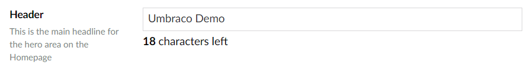

# Textbox Property

`Alias: Umbraco.Textbox`

`Returns: String`

Textbox is an HTML input control for text. It can be configured to have a fixed character limit. The default maximum amount of characters is 500 unless it's specifically changed to a lower amount.

## Data Type Definition Example

### Without a character limit


## Content Example

### Without a character limit


### With a character limit



## MVC View Example



```csharp
@{
    if (Model.HasValue("pageTitle")){
        <p>@(Model.Value("pageTitle"))</p>
    }
}
```



```csharp
@{
    if (Model.Content.HasValue("pageTitle")){
        <p>@(Model.Content.GetPropertyValue<string>("pageTitle"))</p>
    }
}
```



